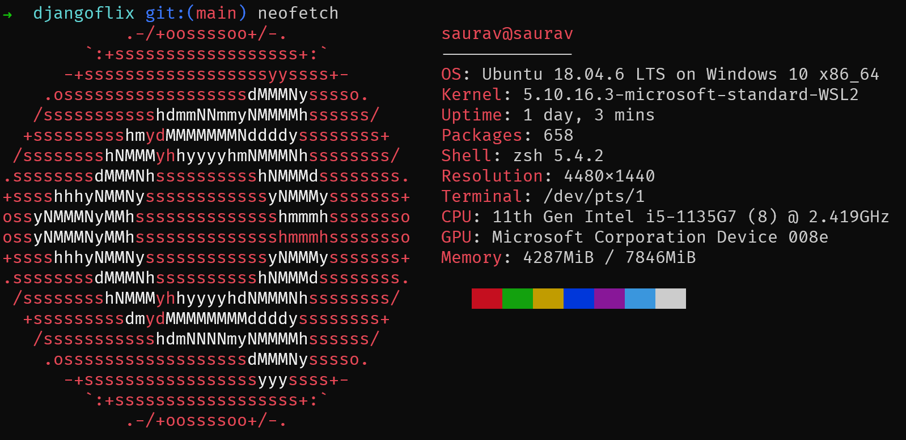
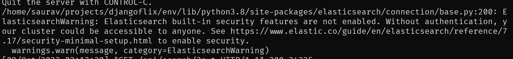
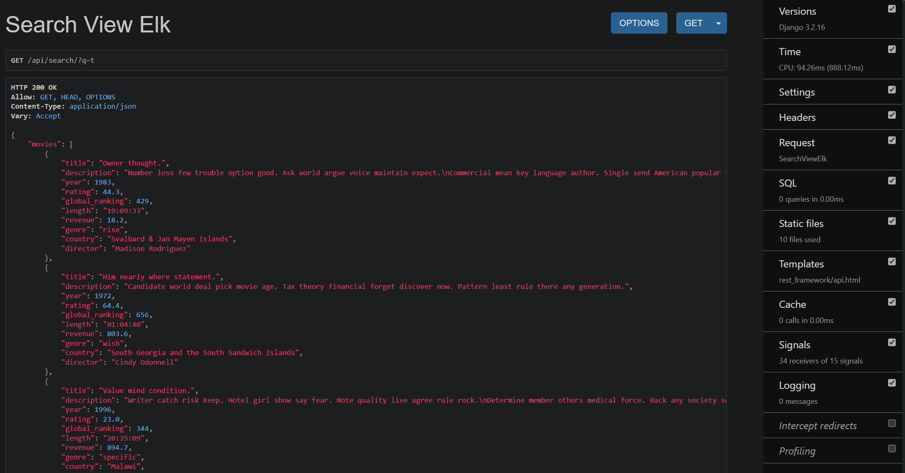

# DjangoFlix - Search from a millions of movies and TV shows using Django + ElasticSearch 🚀

DjangoFlix App is a Django App that allows you to search for movies and TV shows from a millions of titles. It uses the [ElasticSearch 7](https://www.elastic.co/) as a search engine and [Django-Haystack](https://django-haystack.readthedocs.io/en/latest/) to integrate it with Django. So Far ElasticSearch is the best search engine for searching text and it is very fast. It is also very easy to integrate with Django. While Searching through the app, you can also filter the results by year, genre, and rating. If you make this Same functionality using
Default Django Search like using `icontains` or `contains` then it will take a lot of time to search and filter the results. But with ElasticSearch, it is very fast and easy to use.

This project is under work and I am trying to add some video streaming functionality to this. so please check commits, if you are unsure about which point to browse this repo's codebase.

## Tested On - WSL2 Ubuntu 18.04 LTS



## Setup

### Note: If you have Docker, then you can simply run the app using Docker. Just type `docker-compose up` in the terminal and it will run the app. But if you want to run the app without Docker then follow the steps below

### 1. Clone the repo

```bash
git clone https://github.com/selftaughtdev-me/movie-search-api.git
```

### 2. Install required packages

```bash
sudo apt update -y
# install postgresql as sqlite is not efficient enough to handle millions of records
sudo apt install libpq-dev postgresql postgresql-contrib -y
sudo service postgresql start
# install python3 & build-essential
sudo add-apt-repository ppa:deadsnakes/ppa  # for all python versions
sudo apt update -y
sudo apt-get install apt-transport-https
sudo apt install python3.8 python3.8-dev python3.8-venv build-essential -y
# install java as it is required for elasticsearch
sudo apt install openjdk-11-jdk openjdk-11-jre -y
# install ElasticSearch
curl -fsSL https://artifacts.elastic.co/GPG-KEY-elasticsearch | sudo apt-key add -
echo "deb https://artifacts.elastic.co/packages/7.x/apt stable main" | sudo tee -a /etc/apt/sources.list.d/elastic-7.x.list
sudo apt update
sudo apt install elasticsearch -y
sudo service elasticsearch start
sudo service elasticsearch status
```

### 3. Create a Database 🗃️

```bash
sudo -u postgres psql
CREATE DATABASE django_flix;
CREATE USER django_flix_user WITH PASSWORD 'html_programmer';
ALTER ROLE django_flix_user SET client_encoding TO 'utf8';
ALTER ROLE django_flix_user SET default_transaction_isolation TO 'read committed';
ALTER ROLE django_flix_user SET timezone TO 'UTC';
GRANT ALL PRIVILEGES ON DATABASE django_flix TO django_flix_user;
\q
```

### 3. Install requirements & migrate

```bash
# inside project root directory
python3.8 -m venv venv
source venv/bin/activate
pip install --upgrade pip
pip install wheel
pip install -r requirements.txt
# migrate
./manage.py migrate
./manage.py createsuperuser
```

### 4. Generate Test Data 📈

#### 🎞️ This Command will take a while & populate the Database with 1M random movies

- 💡To Save Time, I only tried this API with 600K records, which took a lot of time. So I would suggest to try with just 5000 record & run this command in different terminal windows to generate data in parallel.

```bash
./manage.py generate_test_data 1000000
```

### 5. After Data is Generated, HeadOver to below Endpoints

```bash
./manage.py runserver
http://localhost:8000/api/?q=t
http://localhost:8000/api/search/?q=t&facets=year:1983
http://localhost:8000/api/search/?q=t&facets=year:1983,genre:rise
```

### 📌You Can ignore this ElasticSearch Warning while you are not using it in production



### 📌The Generated Data is not realistic.. it's just for demo purpose. But as you can see in debug panel on the right side, the SQL count is 0 which means it is not hitting the database. It is directly hitting the ElasticSearch



## Helpful Links

- [Django](https://www.djangoproject.com/)
- [ElasticSearch 7 Installation guide](https://www.digitalocean.com/community/tutorials/how-to-install-and-configure-elasticsearch-on-ubuntu-20-04)
